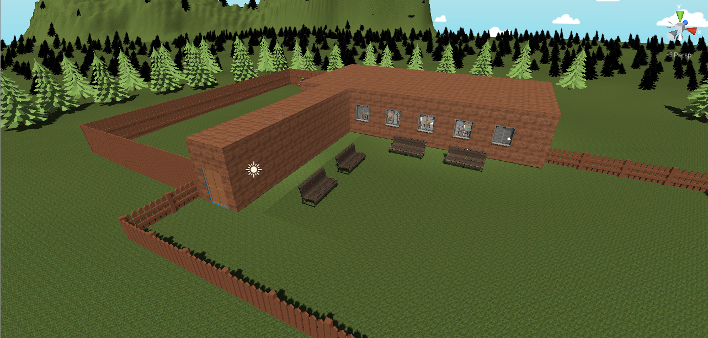
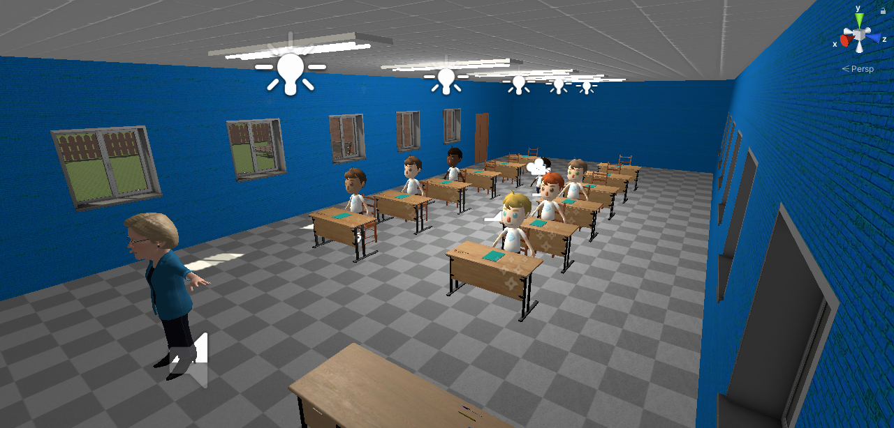

# It's a Bell

## Cuestiones importantes para el uso

Esta aplicación ha sido desarrollada en Unity y está optimizada para su uso con Google Cardboard.
Se puede utilizar un controlador inalámbrico para controlar al personaje principal.

## Especificación base

[Miniproyecto](https://github.com/alu0100913033/InterfacesInteligentes/blob/master/Miniproyecto/README.md)

## Hitos

- [x] Modelos de los personajes
* Variedad de personajes gracias a la modificación de personajes de la asset store.
- [x] Animaciones para los personajes
- [x] Sistema de partículas
- [x] Skybox
- [x] Entorno agradable, con terreno personalizado
- [x] Uso de eventos de Unity
- [x] Uso de las librerías GoogleVR
* Además te puedes mover por el entorno gracias a un gamepad y realizar varias acciones.
* Cuenta con una retícula.
- [x] Scripts para la interación entre las entidades de la escena.
* Todo el código está documentado.

## Destacable

Minijuego sencillo, uso de librerías GoogleVR para hacerlo una aplicación de Realidad Virtual.
Ofrece seguimiento de cabeza y es compatible con controlador externo.

## Gif animado de ejecución

## Imagenes de la aplicación

## Acta de los acuerdos del grupo respecto al trabajo en equipo

Tablón de tareas: [Trello](https://trello.com/b/JBc1Nq8R/its-a-bell)

### Tareas de Felipe:

- Escenarios
- Sistema de partículas
- Búsqueda de sonidos

### Tareas de Alberto:

- Modelos de personajes
- Animaciones
- Sistema de sonido

### Tareas en Común:

- Redacción de este documento
- Scripts
- Soporte de funcionalidades VR
- Resolución de bugs y errores
